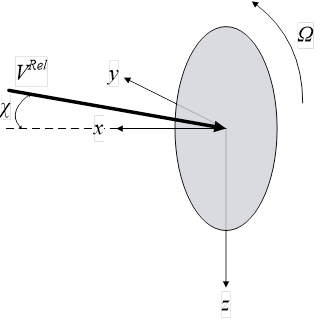
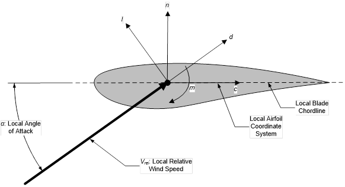

.. _kad_appendix:

Appendix
========

.. _kad_input_files:

KiteAeroDyn Input Files
~~~~~~~~~~~~~~~~~~~~~~~

In this appendix we describe the KiteAeroDyn input file structure and
provide examples.

1) KiteAeroDyn Driver Input File
:download:`(driver input file example) <examples/kad_driver_example.inp>`:

The driver input file is only needed for the standalone version of
KiteAeroDyn and contains inputs to KiteAeroDyn normally defined by the
calling program (KiteFAST), and necessary to control the aerodynamic
simulation for uncoupled models.

2) KiteAeroDyn Primary Input File
:download:`(primary input file example) <examples/kad_primary_example.inp>`:

The primary KiteAeroDyn input file defines modeling options, environmental
conditions (except freestream flow), airfoils, kite nodal discretization and
properties, rotor properties, as well as output file specifications.

The file is organized into several functional sections. Each section
corresponds to an aspect of the aerodynamics model.

3) Airfoil Data Input File
:download:`(airfoil data input file example) <examples/kad_airfoil_example.inp>`:

The airfoil data input files themselves (one for each airfoil) include
tables containing coefficients of lift force, drag force, and pitching
moment versus AoA, as well as unsteady airfoil aerodynamic model parameters.

4) Rotor Data Input File
:download:`(rotor data input file example) <examples/kad_disk_example.inp>`:

The rotor data input file contains the rotor performance coefficient data
as a function of rotor speed, inflow velocity, inflow skew angle, and
collective-rotor blade pitch. Separate files are used for each rotor.

The local rotor coordinate system is shown in :numref:`kad_rotor_cs` below.
Figure :numref:`kad_rotor_cs` also shows the direction of the local angles
and sign conventions.

.. _kad_rotor_cs:

   KiteAeroDyn Local Rotor Coordinate System –  
   x: Normal (to Rotor Disk, pointed forward, in the primary direction of flight), 
   y: Tangential (to Plane, and contains VRel), 
   Ω: Rotor rotational velocity (positive rotation is about positive local x),
   χ: Skew angle (angle between local x and VRel vector, positive angle about positive local z),
   VRel: Inflow wind speed (in local x-y plane)
   
.. _kad_output_channels:

KiteAeroDyn List of Output Channels
~~~~~~~~~~~~~~~~~~~~~~~~~~~~~~~~~~~

This is a list of all possible output parameters for the KiteAeroDyn module.  The names are grouped by meaning, 
but can be ordered in the OUTPUTS section of the KiteAeroDyn input file as you see fit.  
``Fusβ`` refers to output node β on the fuselage, where β is a one-digit number in the range [1,9] corresponding to the
center of the element where entry β in the ``FusOutNd`` list defines the endpoint with the smallest x. Setting β >
``NFusOuts`` yields invalid output.
``SWnβ`` and ``PWnβ`` refer to output node β on the starboard and port wings, respectively, where β is a one-digit
number in the range [1,9] corresponding to the center of the element where entry β in the ``SWnOutNd`` and
``PWnOutNd`` lists define the endpoints with the smallest y and largest y, respectively. Setting β > ``NSWnOuts`` and
``NPWnOuts``, respectively, yields invalid output. ``SFlpα`` and ``PFlpα`` refer to flap α on the starboard and port wings,
respectively, where α is a one-digit number in the range [1,9]. If ``NumFlaps`` > 9, only the first 9 flaps can be output.
``VSβ`` refers to output node β on the vertical stabilizer, where β is a one-digit number in the range [1,9] corresponding
to the center of the element where entry β in the ``VSOutNd`` list defines the endpoint with the smallest z. 
Setting β > ``NVSOuts`` yields invalid output. ``Rudrα`` refers to rudder α on the vertical stabilizer, 
where α is a one-digit number in the range [1,2].
``SHSβ`` and ``PHSβ`` refer to output node β on the starboard and port horizontal stabilizers, respectively, where β is a
one-digit number in the range [1,9] corresponding to the center of the element where entry β in the ``SHSOutNd``
and ``PHSOutNd`` lists define the endpoints with the smallest y and largest y, respectively. Setting β > ``NSHSOuts``
and ``NPHSOuts``, respectively, yields invalid output. ``SElvα`` and ``PElvα`` refer to elevator α on the starboard and port
horizontal stabilizers, respectively, where α is a one-digit number in the range [1,2].
``SPα`` and ``PPα`` refer to pylon α on the starboard and port wings, respectively, where α is a one-digit number in the
range [1,9]. ``SPαβ`` and ``PPαβ`` refer to output node β on pylon α on the starboard and port wings, respectively, where
α is a one-digit number in the range [1,9] and β is a one-digit number in the range [1,9] corresponding to the center
of the element where entry β in the ``PylOutNd`` list defines the endpoint with the smallest z. Setting α > ``NumPylons``
or setting β > ``NPylOuts`` yields invalid output. If ``NumPylons`` > 9, only the first 9 pylons can be output.
For the fuselage, wings, vertical stabilizer, horizontal stabilizers, and pylons, the local airfoil coordinate system,
including the local angle of attack and force components, is shown below. The spanwise ( s ) axis is not shown,
but is directed into the page following the right-hand rule i.e. s = n x c , where n is normal to the chord pointed
toward the suction surface and c is along the chord pointed toward the trailing edge.

The local airfoil coordinate system is shown in :numref:`kad_blade_local_cs` below.  
Figure :numref:`kad_blade_local_cs` also shows the direction of the local angles and force components.

.. _kad_blade_local_cs:

   KiteAeroDyn Local Airfoil Coordinate System (Looking outboard) – l: Lift, d: Drag, m: Pitching, x: Normal (to Plane), 
   y: Tangential (to Plane), n: Normal (to Chord), 
   and c: Tangential (to Chord)

.. _kad-output-channel:

.. figure:: figs/kad_output_channel.pdf
   :width: 500px
   :align: center

   KiteAeroDyn Output Channel List
